<h1 align="center">⚡ GridTwin</h1>

<p align="center">
  <strong>An Interactive 3D Digital Twin for Intelligent Distribution Grid Simulation</strong>
</p>

<p align="center">
  Simulate • Visualize • Analyze • Detect • Compare • Optimize
</p>

<p align="center">

  

  

  

  

  

  

  

  

  

  

</p>

---

# 🌐 What is GridTwin?

**GridTwin** is an interactive digital twin platform for electrical distribution networks.

It combines:

- ⚡ Electrical power-flow simulation
- 🌐 Interactive 3D digital twin
- ☀️ Solar generation
- 🔋 Battery Energy Storage System (BESS)
- 🏠 Electrical loads
- 🌦️ Weather data
- 🚨 Constraint and violation detection
- 📊 Advanced analytics
- 🕐 Minute-by-minute simulation
- 🔬 Baseline vs DER comparison
- 🧪 What-If analysis
- 📉 Power-loss analysis
- 🔄 Animated power-flow visualization

---

# 💡 The Idea
GridTwin follows a simple concept:

```text
Electrical Data
      ↓
Data Processing
      ↓
Power-Flow Simulation
      ↓
Electrical Results
      ↓
Constraint + Loss Analysis
      ↓
Simulation History
      ↓
Interactive 3D Digital Twin
      ↓
Timeline + Analytics
```

The frontend should not invent electrical results.

Electrical values such as power flow, loading, voltage, and losses should originate from the simulation/backend results and then be presented visually.

The goal is simple:

> ### Don't just calculate what is happening in the grid.  
> ### Let the user actually see it.

---

# 🎯 Core Concept

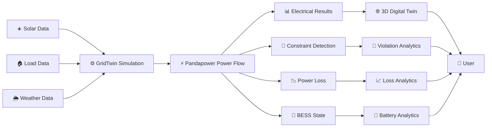
# System Architecture
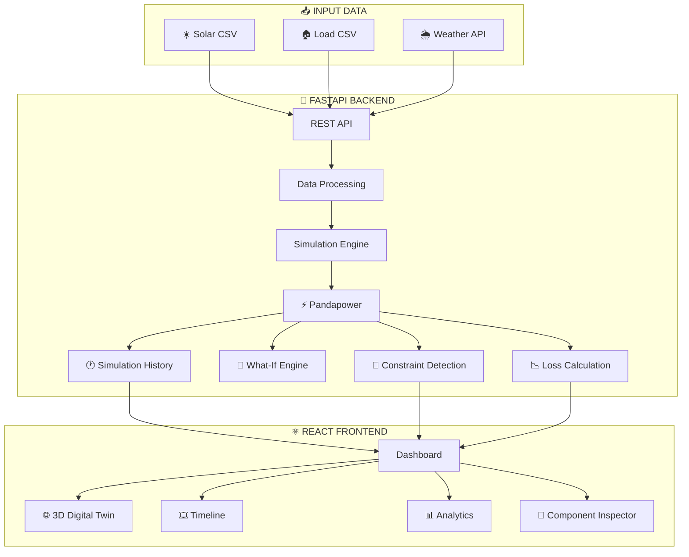

# 🔎 GridTwin at a Glance

| Capability           | Purpose                                           |
| -------------------- | ------------------------------------------------- |
| 3D Digital Twin      | Visual representation of the distribution network |
| Power Flow           | Calculates electrical operating conditions        |
| Solar Time Series    | Represents distributed renewable generation       |
| Load Time Series     | Represents electricity consumption                |
| Weather              | Provides environmental context                    |
| BESS                 | Represents battery storage behavior               |
| Timeline             | Moves through minute-level simulation history     |
| Constraint Detection | Identifies configured electrical limits           |
| Power Loss Analytics | Examines simulated electrical losses              |
| Historical Analysis  | Inspects previously calculated timesteps          |
| What-If Analysis     | Tests changes without modifying the baseline      |
| Baseline vs DER      | Compares original and DER scenarios               |

---

# 🏗️ Architecture

## Overall Architecture

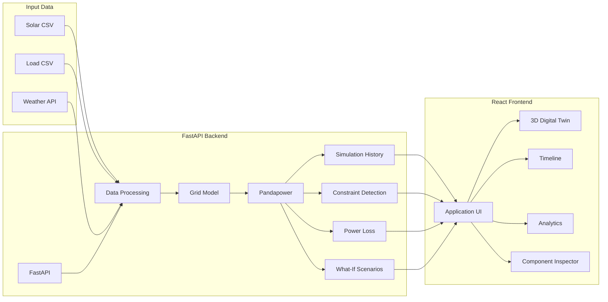

---

## Simulation Flow

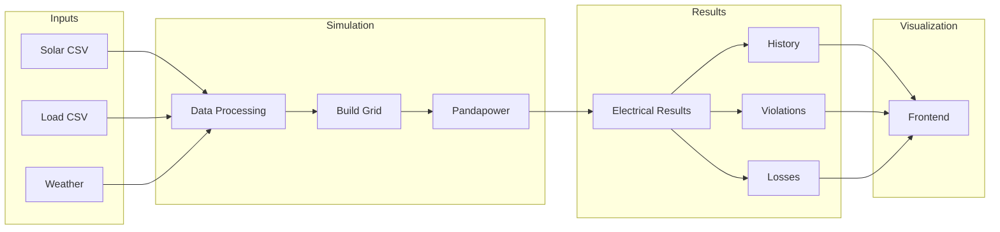

---

## Data Flow

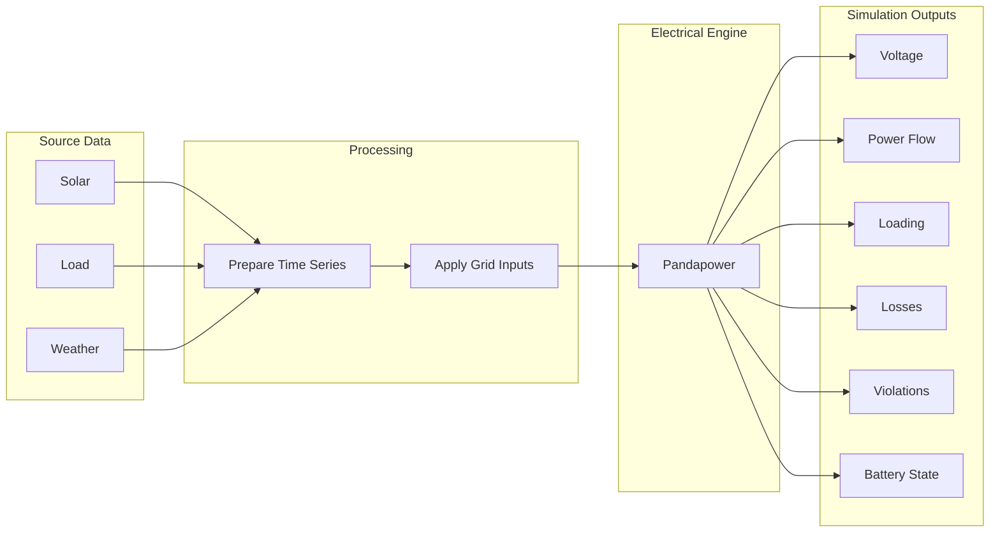

---

## Timeline Synchronization

GridTwin uses one canonical simulation position:

```text
selectedTimestepIndex
```

Every historical visualization should derive its state from this selected index.

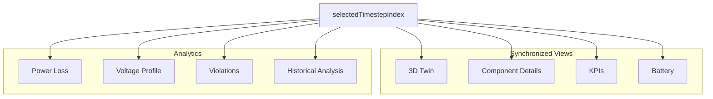

### Why this matters

If the user selects `00:08`, every part of the application should represent the **00:08 state**.

The following should therefore remain synchronized:

* 3D digital twin
* Component sidebar
* KPIs
* Battery analytics
* Power-loss analytics
* Voltage profile
* Violation history
* Historical analysis

The application should not mix a selected historical state with the latest simulation state.

Simulation history should be cached so moving the timeline can retrieve an already calculated state instead of rerunning Pandapower for every slider movement.

---

## Constraint Detection

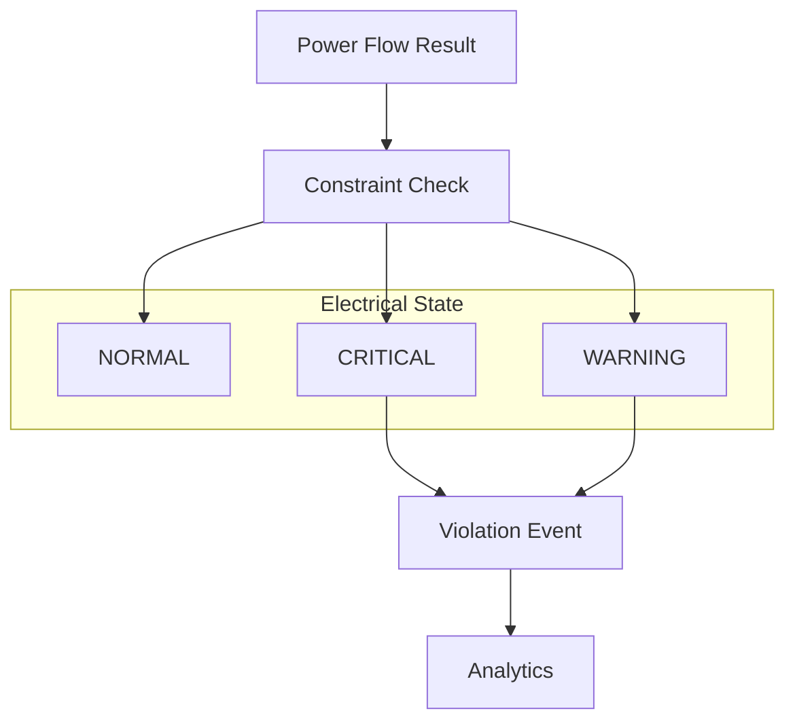

The exact state should be derived from **calculated values compared against configured limits**, rather than from arbitrary frontend colors.

---

## What-If Analysis

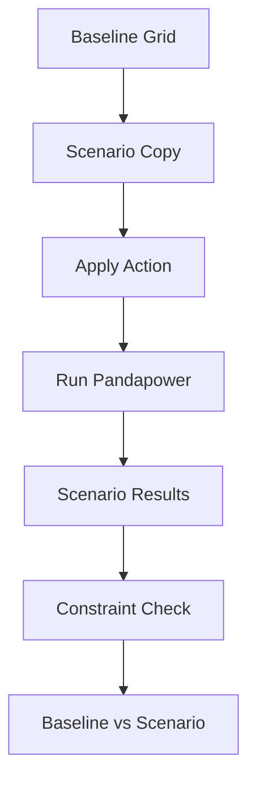

The baseline network remains unchanged while the scenario operates on a copy.

---

## Future Real-Time Architecture

> [!IMPORTANT]
> The following architecture represents a **future roadmap**, not a claim that GridTwin currently implements utility-grade real-time operation.

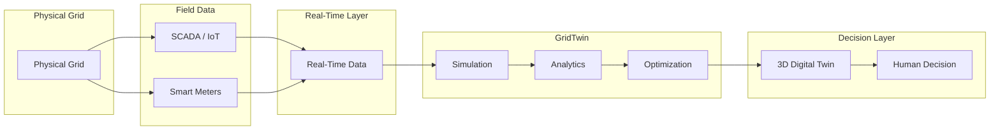

---

## Future Predictive Intelligence

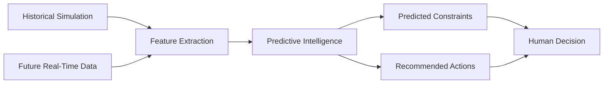

This represents a future architecture for predictive constraint detection and decision support.

---

---

# 🌐 3D Digital Twin

GridTwin represents the distribution network through interactive 3D assets.

The visual environment can contain concepts such as:

| Component           | Simple explanation                                     |
| ------------------- | ------------------------------------------------------ |
| 🏠 House            | Represents an electricity-consuming location or load   |
| ☀️ Solar Panel      | Represents distributed solar generation                |
| ☀️ Solar Farm       | Represents a larger solar-generation source            |
| 🔋 Battery          | Represents energy storage                              |
| 🔌 Transformer      | Changes electrical voltage levels                      |
| 🏭 Substation       | Represents a major point in the distribution network   |
| ⚡ Electrical Bus    | Represents an electrical connection point in the model |
| ─ Distribution Line | Connects electrical buses and carries power            |

The 3D assets can be represented using **GLB/GLTF models**.

---

# 🔋 Animated Power Flow

Electrical connections can be represented through animated flow lines.

The animation communicates the direction or movement of electrical power through the modeled network.

The visual state should be derived from calculated electrical values and configured thresholds.

| State     | Visual meaning                         |
| --------- | -------------------------------------- |
| 🟢 Green  | Normal operating condition             |
| 🟡 Yellow | Warning / approaching configured limit |
| 🔴 Red    | Critical / configured limit exceeded   |

These colors are therefore not arbitrary decoration.

For example, a line's visual state can be determined from its calculated loading percentage compared with the configured operating limi
# 🌦️ Weather

GridTwin can retrieve live weather information through a weather API.

Example fields include:

| Field                   | Meaning                   |
| ----------------------- | ------------------------- |
| `temperature_c`         | Temperature in Celsius    |
| `cloud_cover_percent`   | Cloud coverage percentage |
| `solar_irradiance_w_m2` | Solar irradiance          |
| `humidity_percent`      | Relative humidity         |
| `wind_speed_m_s`        | Wind speed                |


Weather provides environmental context and can potentially influence renewable-generation scenarios.
## Weather API Configuration
Create:
```text
backend/.env
```
Add:
```env
WEATHER_API_KEY=your_api_key_here
```
> [!WARNING]
> Never commit API keys or other secrets to GitHub.
---

# 🔋 BESS — Battery Energy Storage System

**BESS** means **Battery Energy Storage System**.

A battery can store electrical energy and later release it back into the network.

GridTwin can represent three basic battery states:

| State       | Meaning                                         |
| ----------- | ----------------------------------------------- |
| `CHARGE`    | Battery is absorbing/storing energy             |
| `IDLE`      | Battery is not actively charging or discharging |
| `DISCHARGE` | Battery is supplying stored energy              |

---
# ⚡ Electrical Bus
A **bus** is an electrical connection point in the network model.
It is where components connect and where electrical quantities such as voltage can be evaluated.
In simple terms:
> A bus is a point in the electrical model where different parts of the network meet.
A bus is primarily an **electrical modeling concept** and does not necessarily represent a physical object.

---
# ─ Distribution Lines
A distribution line connects electrical buses and carries power through the network.
GridTwin can track:

| Line Metric        | Meaning                                                                |
| ------------------ | ---------------------------------------------------------------------- |
| Loading percentage | How heavily the line is being used relative to its configured capacity |
| Power flow         | Electrical power moving through the line                               |
| Losses             | Electrical energy/power lost in the line                               |
| Operating state    | Current calculated condition                                           |

Example feeder identifiers may include:
```text
line_01
line_02
line_03
line_04
line_05
```
The exact number and naming of lines depends on the configured network model.

---
# 🔌 Transformer
A transformer changes electrical voltage levels between parts of the network.
This is important because distribution networks operate across different voltage levels.

GridTwin can track:

* Transformer loading
* Power flow
* Operating state

Transformer constraints can therefore be detected alongside line and voltage constraints.
---
# 🚨 Constraint / Violation Detection

GridTwin detects electrical constraints by comparing calculated values against configured limits.

Conceptually:

```text
Actual Value
     vs
Configured Limit
```
Possible states are:

```text
NORMAL
WARNING
CRITICAL
```
Examples include:

* Low voltage
* High line loading
* Transformer overload

A violation record can contain:

| Field            | Description                                 |
| ---------------- | ------------------------------------------- |
| Timestamp        | Time at which the condition occurred        |
| Component        | Affected component                          |
| Component ID     | Identifier of the affected component        |
| Violation type   | Type of electrical constraint               |
| Actual value     | Calculated value                            |
| Configured limit | Applicable threshold                        |
| Severity         | Normal, warning, or critical classification |

The important principle is that violation status should be derived from **actual simulation results and configured limits**, not arbitrary frontend values.
---

# 📊 Analytics Dashboard

GridTwin's analytics layer can expose several complementary views.

| Analytics           | Purpose                                                    |
| ------------------- | ---------------------------------------------------------- |
| Voltage Profile     | Understand voltage conditions across the network           |
| Line Loading        | Inspect utilization of distribution lines                  |
| Power Loss          | Identify simulated electrical losses                       |
| Battery Analytics   | Inspect SOC and charge/discharge behavior                  |
| Violation History   | Review detected constraints over time                      |
| Historical Analysis | Explore simulation behavior across timestamps              |
| Baseline vs DER     | Compare original and distributed-energy-resource scenarios |

All historical analytics should remain synchronized with `selectedTimestepIndex` where the metric represents a single simulation timestep.
---
# 📈 Voltage Profile

Voltage profile analysis shows how calculated voltage varies across the modeled network.

It can help identify:

* Normal voltage conditions
* Low-voltage conditions
* High-voltage conditions
* Changes caused by load
* Changes caused by distributed generation

Voltage values should originate from the electrical simulation.

---

# 📊 Line Loading

Line loading indicates how heavily a distribution line is being used relative to its configured limit.

Conceptually:

```text
Calculated Loading
        ↓
Configured Limit
        ↓
Operating State
```

This metric is particularly useful for identifying lines that approach or exceed configured operating limits.

---

# 🔋 Battery Analytics

Battery analytics can include:

* Current SOC
* Battery power
* Current state
* Charge/discharge history
* SOC over time
* Behavior during scenarios

Battery analytics should use the same selected simulation timestamp as the rest of the application when displaying a historical state.

---

### Comparison Flow

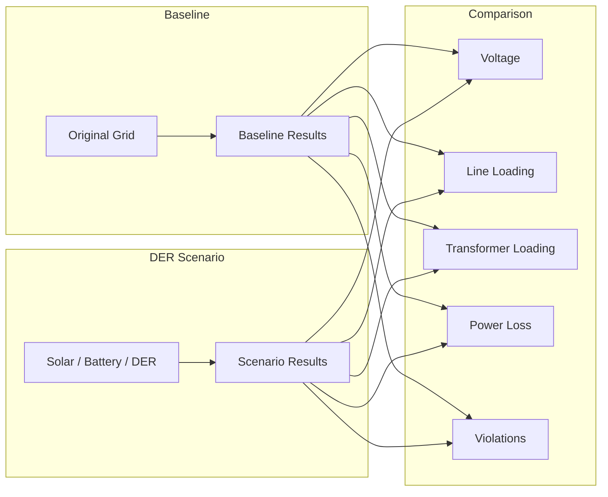

The comparison should use calculated simulation values rather than presentation-only values.

---
### What-If Architecture

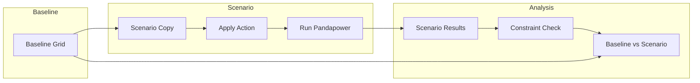
---

# 📥 Input Data

GridTwin currently uses:

```text
solar.csv
load.csv
```

The two datasets represent different sides of the electrical balance:

| Dataset     | Represents  |
| ----------- | ----------- |
| `solar.csv` | Generation  |
| `load.csv`  | Consumption |

Together, they influence the electrical conditions calculated by the simulation.

---

# 🛠️ Technology Stack

| Technology        | Role                                           |
| ----------------- | ---------------------------------------------- |
| React             | Frontend application                           |
| TypeScript        | Type-safe frontend development                 |
| Three.js          | 3D rendering                                   |
| React Three Fiber | React integration for Three.js                 |
| GLB / GLTF        | 3D assets                                      |
| FastAPI           | Python backend/API layer                       |
| Python            | Simulation backend                             |
| Pandapower        | Electrical network and power-flow calculations |
| Pandas            | Time-series/data processing                    |
| NumPy             | Numerical computation                          |
| Weather API       | Environmental/weather information              |
| Solar Data        | Renewable-generation input                     |
| Load Data         | Electricity-consumption input                  |

---

# 📁 Project Structure

## 🏗️ GridTwin System Architecture

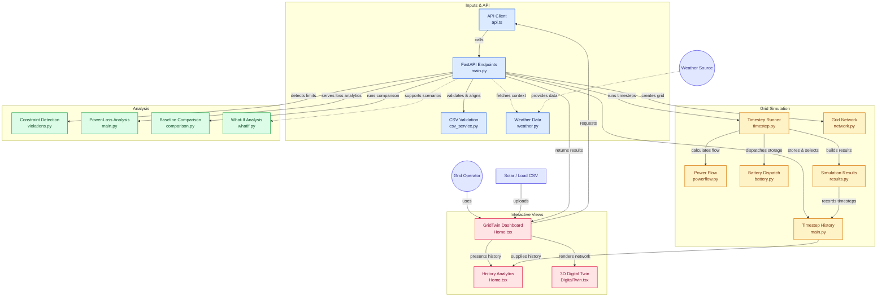

### 🔗 Code References

| Component | Source |
|---|---|
| API Client | [`client/src/lib/api.ts`](client/src/lib/api.ts) |
| FastAPI | [`backend/app/main.py`](backend/app/main.py) |
| CSV Validation | [`backend/app/services/csv_service.py`](backend/app/services/csv_service.py) |
| Weather | [`backend/app/services/weather.py`](backend/app/services/weather.py) |
| Timestep Runner | [`backend/app/simulation/timestep.py`](backend/app/simulation/timestep.py) |
| Power Flow | [`backend/app/simulation/powerflow.py`](backend/app/simulation/powerflow.py) |
| Grid Network | [`backend/app/simulation/network.py`](backend/app/simulation/network.py) |
| Battery Dispatch | [`backend/app/simulation/battery.py`](backend/app/simulation/battery.py) |
| Simulation Results | [`backend/app/simulation/results.py`](backend/app/simulation/results.py) |
| Constraint Detection | [`backend/app/simulation/violations.py`](backend/app/simulation/violations.py) |
| Baseline Comparison | [`backend/app/simulation/comparison.py`](backend/app/simulation/comparison.py) |
| What-If Analysis | [`backend/app/simulation/whatif.py`](backend/app/simulation/whatif.py) |
| Dashboard | [`client/src/pages/Home.tsx`](client/src/pages/Home.tsx) |
| 3D Digital Twin | [`client/src/components/digital-twin/DigitalTwin.tsx`](client/src/components/digital-twin/DigitalTwin.tsx) |


---

# 🚀 Installation

## Prerequisites

Depending on the current implementation, you will need:

* Python
* Node.js
* pnpm
* Git

---

## Backend Setup — Windows

Create a Python virtual environment:

```powershell
py -m venv .venv
```

Activate it:

```powershell
.\.venv\Scripts\Activate.ps1
```

Install backend dependencies:

```powershell
py -m pip install -r backend\requirements.txt
```

---

# ▶️ Running the Backend

Start FastAPI with Uvicorn:

```powershell
py -m uvicorn app.main:app --app-dir backend --reload
```

A typical backend address is:

```text
http://127.0.0.1:8000
```

FastAPI's interactive documentation is typically available at:

```text
http://127.0.0.1:8000/docs
```

> [!NOTE]
> These URLs depend on the current project configuration and should not be treated as guaranteed if ports or server settings have been changed.

---

# 💻 Running the Frontend

Install frontend dependencies:

```powershell
pnpm install
```

Start the development server:

```powershell
pnpm dev
```

A typical frontend address is:

```text
http://localhost:3000
```

> [!NOTE]
> The actual frontend port depends on the project's current configuration.

---

# 🧭 Using GridTwin

A typical GridTwin workflow is:

### 1. Start the backend

Run the FastAPI server.

### 2. Start the frontend

Run the React development server.

### 3. Load simulation data

Provide the configured:

```text
solar.csv
load.csv
```

### 4. Run the simulation

The backend processes the input data and runs the electrical simulation.

### 5. Open the digital twin

Inspect the network in the interactive 3D environment.

### 6. Select a component

Click a component to inspect its details.

### 7. Navigate through time

Use the timeline to move through the simulation.

### 8. Inspect analytics

Review:

* Voltage
* Line loading
* Power loss
* Battery state
* Violations
* Historical information
---

# 🔌 API Overview

The backend is based on FastAPI.

The exact endpoint names depend on the current implementation and should be documented from the actual backend routes rather than assumed.

A typical conceptual API surface may include areas such as:

| API Area    | Purpose                              |
| ----------- | ------------------------------------ |
| Simulation  | Run or retrieve simulation results   |
| History     | Retrieve historical timestep results |
| Components  | Retrieve component information       |
| Analytics   | Retrieve calculated analytics        |
| Weather     | Retrieve weather context             |
| Constraints | Retrieve detected violations         |
| What-If     | Run supported scenarios              |

> [!NOTE]
> Endpoint names and request/response schemas are intentionally not invented here. Refer to the current FastAPI implementation and `/docs` for the authoritative API contract.

---

# 📌 Current Scope

The current GridTwin concept includes:

* Interactive 3D grid visualization
* Electrical power-flow simulation
* Pandapower integration
* Solar time-series input
* Load time-series input
* BESS representation
* Weather context
* Minute-level simulation
* Shared selected timestep
* Constraint detection
* Power-loss analysis
* Historical analysis
* What-If analysis
* Baseline vs DER comparison

The exact availability of each feature depends on the current implementation in the repository.

# 🛣️ Future Roadmap

| Stage        | Capabilities                                                                                                                                             |
| ------------ | -------------------------------------------------------------------------------------------------------------------------------------------------------- |
| **CURRENT**  | 3D Twin, Pandapower, Solar, Load, BESS, Weather, Time-Series Simulation, Constraint Detection, Power Loss, Historical Analysis, What-If, Baseline vs DER |
| **ADVANCED** | Battery optimization, Solar curtailment optimization, Voltage optimization, Loss minimization                                                            |
| **FUTURE**   | SCADA, IoT, Smart Meters, Real-Time Data, Machine Learning, Predictive Constraint Detection                                                              |

---
# 🛰️ Real-Time Architecture

The long-term concept for GridTwin is to connect the digital twin with real-world grid data.

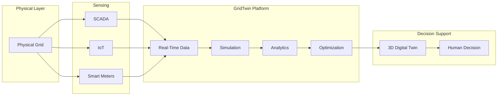

> [!WARNING]
> This is a **future architecture**. It does not imply that GridTwin currently has direct SCADA, IoT, smart-meter, or utility control integration.

---

# 🤖 Predictive Intelligence

A future version of GridTwin could use historical and real-time data to identify patterns before a configured constraint occurs.

Potential workflow:

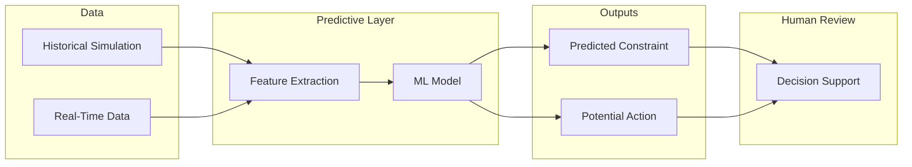

# 🧠 Electrical Concepts at a Glance

| Concept     | Simple Explanation                                             |
| ----------- | -------------------------------------------------------------- |
| Power Flow  | How electrical power moves through the network                 |
| Voltage     | Electrical potential measured at modeled network points        |
| Bus         | Electrical connection point in the model                       |
| Line        | Connection that carries power between buses                    |
| Transformer | Changes voltage levels                                         |
| Load        | Electricity consumption                                        |
| Solar       | Distributed renewable generation                               |
| BESS        | Battery energy storage                                         |
| SOC         | Amount of usable battery energy currently stored               |
| DER         | Distributed Energy Resource                                    |
| Constraint  | A calculated value approaching or exceeding a configured limit |
| Power Loss  | Electrical power/energy lost in network elements               |

---


# 🔄 End-to-End Concept

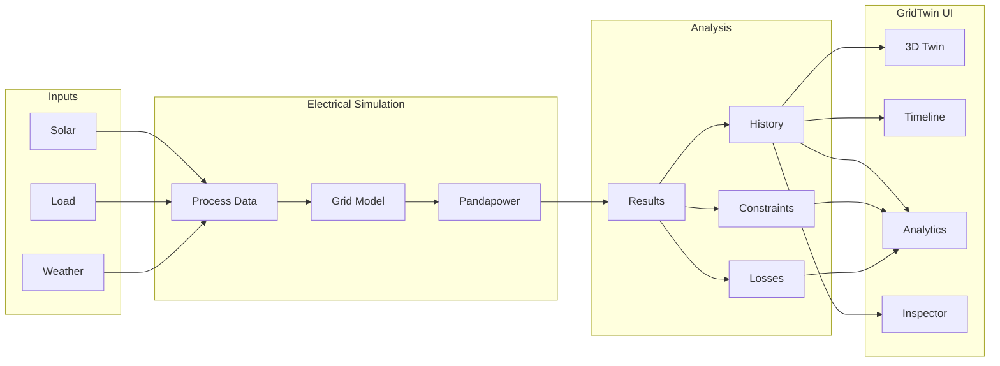

---

# 📋 Component Reference

| Component   | Role                             | Example Information   |
| ----------- | -------------------------------- | --------------------- |
| House       | Represents consumption           | Load                  |
| Solar Panel | Represents solar generation      | Solar power           |
| Solar Farm  | Represents larger generation     | Generated power       |
| Battery     | Represents energy storage        | SOC, charge/discharge |
| Bus         | Electrical connection point      | Voltage               |
| Line        | Carries power between buses      | Flow, loading, losses |
| Transformer | Changes voltage levels           | Loading, flow         |
| Substation  | Represents a major network point | Network connection    |

---

# 📊 Analytics Reference

| Analytics           | Primary Question                                |
| ------------------- | ----------------------------------------------- |
| Voltage Profile     | Where are voltage conditions changing?          |
| Line Loading        | Which lines are heavily loaded?                 |
| Power Loss          | Where are simulated losses occurring?           |
| Battery Analytics   | What is the battery doing?                      |
| Violation History   | When and where did constraints occur?           |
| Historical Analysis | How did the network change over time?           |
| Baseline vs DER     | How does the DER scenario differ from baseline? |

---

# 🚨 Constraint Reference

| Constraint           | Example Condition                                              |
| -------------------- | -------------------------------------------------------------- |
| Low Voltage          | Calculated voltage below configured threshold                  |
| High Line Loading    | Calculated line loading approaches or exceeds configured limit |
| Transformer Overload | Calculated transformer loading exceeds configured limit        |

The actual thresholds depend on the configured network model and implementation.

---

# 🔋 BESS State Reference

| State       | Description                                  |
| ----------- | -------------------------------------------- |
| `CHARGE`    | Battery stores energy                        |
| `IDLE`      | Battery is not actively charging/discharging |
| `DISCHARGE` | Battery supplies stored energy               |

---
# System Architecture

# 🔎 GridTwin at a Glance

| Capability           | Purpose                                           |
| -------------------- | ------------------------------------------------- |
| 3D Digital Twin      | Visual representation of the distribution network |
| Power Flow           | Calculates electrical operating conditions        |
| Solar Time Series    | Represents distributed renewable generation       |
| Load Time Series     | Represents electricity consumption                |
| Weather              | Provides environmental context                    |
| BESS                 | Represents battery storage behavior               |
| Timeline             | Moves through minute-level simulation history     |
| Constraint Detection | Identifies configured electrical limits           |
| Power Loss Analytics | Examines simulated electrical losses              |
| Historical Analysis  | Inspects previously calculated timesteps          |
| What-If Analysis     | Tests changes without modifying the baseline      |
| Baseline vs DER      | Compares original and DER scenarios               |

---

# 🏗️ Architecture

## Overall Architecture


---

## Simulation Flow


---

## Data Flow


---

## Timeline Synchronization

GridTwin uses one canonical simulation position:

```text
selectedTimestepIndex
```

Every historical visualization should derive its state from this selected index.

```mermaid
flowchart TB
    T["selectedTimestepIndex"]

    subgraph VIS["Synchronized Views"]
        D["3D Twin"]
        C["Component Details"]
        K["KPIs"]
        B["Battery"]
    end

    subgraph ANA["Analytics"]
        P["Power Loss"]
        V["Voltage Profile"]
        H["Violations"]
        HA["Historical Analysis"]
    end

    T --> D
    T --> C
    T --> K
    T --> B
    T --> P
    T --> V
    T --> H
    T --> HA
```

## Constraint Detection

```mermaid
flowchart TB
    R["Power Flow Result"]
    C["Constraint Check"]

    subgraph STATES["Electrical State"]
        N["NORMAL"]
        W["WARNING"]
        CR["CRITICAL"]
    end

    E["Violation Event"]
    A["Analytics"]

    R --> C
    C --> N
    C --> W
    C --> CR

    CR --> E
    W --> E
    E --> A
```

The exact state should be derived from **calculated values compared against configured limits**, rather than from arbitrary frontend colors.

---

## What-If Analysis

```mermaid
flowchart TB
    B["Baseline Grid"]
    S["Scenario Copy"]
    A["Apply Action"]
    P["Run Pandapower"]
    R["Scenario Results"]
    C["Constraint Check"]
    COMP["Baseline vs Scenario"]

    B --> S
    S --> A
    A --> P
    P --> R
    R --> C
    C --> COMP
```

The baseline network remains unchanged while the scenario operates on a copy.

---

## Future Real-Time Architecture

> [!IMPORTANT]
> The following architecture represents a **future roadmap**, not a claim that GridTwin currently implements utility-grade real-time operation.

```mermaid
flowchart LR
    subgraph GRID["Physical Grid"]
        PG["Physical Grid"]
    end

    subgraph FIELD["Field Data"]
        SCADA["SCADA / IoT"]
        METERS["Smart Meters"]
    end

    subgraph DATA["Real-Time Layer"]
        RT["Real-Time Data"]
    end

    subgraph GT["GridTwin"]
        SIM["Simulation"]
        ANA["Analytics"]
        OPT["Optimization"]
    end

    subgraph HUMAN["Decision Layer"]
        TWIN["3D Digital Twin"]
        DEC["Human Decision"]
    end

    PG --> SCADA
    PG --> METERS
    SCADA --> RT
    METERS --> RT

    RT --> SIM
    SIM --> ANA
    ANA --> OPT
    OPT --> TWIN
    TWIN --> DEC
```

---

## Future Predictive Intelligence

```mermaid
flowchart LR
    HIST["Historical Simulation"]
    LIVE["Future Real-Time Data"]
    FEATURES["Feature Extraction"]
    ML["Predictive Intelligence"]
    PRED["Predicted Constraints"]
    REC["Recommended Actions"]
    USER["Human Decision"]

    HIST --> FEATURES
    LIVE --> FEATURES
    FEATURES --> ML
    ML --> PRED
    ML --> REC
    PRED --> USER
    REC --> USER
```

This represents a future architecture for predictive constraint detection and decision support.

---

# ⚙️ How the System Works

At a high level, GridTwin follows these stages:

1. Load solar and load time-series data.
2. Obtain weather information when configured.
3. Process the input data.
4. Build or populate the electrical network model.
5. Run power-flow calculations using Pandapower.
6. Store calculated simulation results.
7. Check configured electrical constraints.
8. Calculate power-flow and loss information.
9. Expose the results to the frontend.
10. Synchronize the visual state with `selectedTimestepIndex`.
11. Display the selected state through the 3D digital twin and analytics.
12. Allow scenario analysis without modifying the baseline network.

---

# 🌐 3D Digital Twin

GridTwin represents the distribution network through interactive 3D assets.

The visual environment can contain concepts such as:

| Component           | Simple explanation                                     |
| ------------------- | ------------------------------------------------------ |
| 🏠 House            | Represents an electricity-consuming location or load   |
| ☀️ Solar Panel      | Represents distributed solar generation                |
| ☀️ Solar Farm       | Represents a larger solar-generation source            |
| 🔋 Battery          | Represents energy storage                              |
| 🔌 Transformer      | Changes electrical voltage levels                      |
| 🏭 Substation       | Represents a major point in the distribution network   |
| ⚡ Electrical Bus    | Represents an electrical connection point in the model |
| ─ Distribution Line | Connects electrical buses and carries power            |

The 3D assets can be represented using **GLB/GLTF models**.

### Interaction

Users can:

* Rotate the scene
* Pan the scene
* Zoom
* Select components
* Inspect components
* View component details
* Focus or zoom into selected components

The purpose of the 3D environment is not merely visual decoration. It provides a spatial interface for understanding where electrical components and conditions occur within the modeled network.

---

# 🔋 Animated Power Flow

Electrical connections can be represented through animated flow lines.

The animation communicates the direction or movement of electrical power through the modeled network.

The visual state should be derived from calculated electrical values and configured thresholds.

| State     | Visual meaning                         |
| --------- | -------------------------------------- |
| 🟢 Green  | Normal operating condition             |
| 🟡 Yellow | Warning / approaching configured limit |
| 🔴 Red    | Critical / configured limit exceeded   |

These colors are therefore not arbitrary decoration.

For example, a line's visual state can be determined from its calculated loading percentage compared with the configured operating limit

---

# 🎛️ Timeline

The timeline provides navigation through the simulation history.

Supported controls include:

| Control    | Purpose                            |
| ---------- | ---------------------------------- |
| ▶ Play     | Advance through simulation history |
| ⏸ Pause    | Stop playback                      |
| ◀ Previous | Move to the previous timestep      |
| ▶ Next     | Move to the next timestep          |
| Slider     | Scrub through the simulation       |
| Speed      | Control playback speed             |

---
# 🌦️ Weather

GridTwin can retrieve live weather information through a weather API.

Example fields include:

| Field                   | Meaning                   |
| ----------------------- | ------------------------- |
| `temperature_c`         | Temperature in Celsius    |
| `cloud_cover_percent`   | Cloud coverage percentage |
| `solar_irradiance_w_m2` | Solar irradiance          |
| `humidity_percent`      | Relative humidity         |
| `wind_speed_m_s`        | Wind speed                |

Example response:

```json
{
  "status": "LIVE WEATHER",
  "temperature_c": 29,
  "cloud_cover_percent": 7,
  "solar_irradiance_w_m2": 930,
  "humidity_percent": 74,
  "wind_speed_m_s": 4.63
}
```

Weather provides environmental context and can potentially influence renewable-generation scenarios.

## Weather API Configuration

Create:

```text
backend/.env
```

Add:

```env
WEATHER_API_KEY=your_api_key_here
```

> [!WARNING]
> Never commit API keys or other secrets to GitHub.

---

# 🔋 BESS — Battery Energy Storage System

**BESS** means **Battery Energy Storage System**.

A battery can store electrical energy and later release it back into the network.

GridTwin can represent three basic battery states:

| State       | Meaning                                         |
| ----------- | ----------------------------------------------- |
| `CHARGE`    | Battery is absorbing/storing energy             |
| `IDLE`      | Battery is not actively charging or discharging |
| `DISCHARGE` | Battery is supplying stored energy              |

# 📊 Analytics Dashboard

GridTwin's analytics layer can expose several complementary views.

| Analytics           | Purpose                                                    |
| ------------------- | ---------------------------------------------------------- |
| Voltage Profile     | Understand voltage conditions across the network           |
| Line Loading        | Inspect utilization of distribution lines                  |
| Power Loss          | Identify simulated electrical losses                       |
| Battery Analytics   | Inspect SOC and charge/discharge behavior                  |
| Violation History   | Review detected constraints over time                      |
| Historical Analysis | Explore simulation behavior across timestamps              |
| Baseline vs DER     | Compare original and distributed-energy-resource scenarios |

All historical analytics should remain synchronized with `selectedTimestepIndex` where the metric represents a single simulation timestep.

---
### Comparison Flow

```mermaid
flowchart LR
    subgraph BASE["Baseline"]
        B["Original Grid"]
        BR["Baseline Results"]
    end

    subgraph DER["DER Scenario"]
        D["Solar / Battery / DER"]
        DR["Scenario Results"]
    end

    subgraph COMP["Comparison"]
        V["Voltage"]
        L["Line Loading"]
        T["Transformer Loading"]
        P["Power Loss"]
        C["Violations"]
    end

    B --> BR
    D --> DR

    BR --> V
    DR --> V

    BR --> L
    DR --> L

    BR --> T
    DR --> T

    BR --> P
    DR --> P

    BR --> C
    DR --> C
```

The comparison should use calculated simulation values rather than presentation-only values.

---


## FUTURE

Future integrations may include:

* SCADA
* IoT devices
* Smart meters
* Real-time data streams
* Machine learning
* Predictive constraint detection

These capabilities require additional engineering, data, security, and validation work.

---

# 🛰️ Real-Time Architecture

The long-term concept for GridTwin is to connect the digital twin with real-world grid data.

```mermaid
flowchart LR
    subgraph PHYSICAL["Physical Layer"]
        GRID["Physical Grid"]
    end

    subgraph SENSING["Sensing"]
        SCADA["SCADA"]
        IOT["IoT"]
        METERS["Smart Meters"]
    end

    subgraph PLATFORM["GridTwin Platform"]
        DATA["Real-Time Data"]
        SIM["Simulation"]
        ANA["Analytics"]
        OPT["Optimization"]
    end

    subgraph EXPERIENCE["Decision Support"]
        TWIN["3D Digital Twin"]
        HUMAN["Human Decision"]
    end

    GRID --> SCADA
    GRID --> IOT
    GRID --> METERS

    SCADA --> DATA
    IOT --> DATA
    METERS --> DATA

    DATA --> SIM
    SIM --> ANA
    ANA --> OPT
    OPT --> TWIN
    TWIN --> HUMAN
```

> [!WARNING]
> This is a **future architecture**. It does not imply that GridTwin currently has direct SCADA, IoT, smart-meter, or utility control integration.

---

# 🤖 Predictive Intelligence

A future version of GridTwin could use historical and real-time data to identify patterns before a configured constraint occurs.

Potential workflow:

```mermaid
flowchart LR
    subgraph SOURCES["Data"]
        HIST["Historical Simulation"]
        REAL["Real-Time Data"]
    end

    subgraph INTEL["Predictive Layer"]
        FEAT["Feature Extraction"]
        MODEL["ML Model"]
    end

    subgraph OUTPUT["Outputs"]
        PRED["Predicted Constraint"]
        ACTION["Potential Action"]
    end

    subgraph HUMAN["Human Review"]
        REVIEW["Decision Support"]
    end

    HIST --> FEAT
    REAL --> FEAT
    FEAT --> MODEL
    MODEL --> PRED
    MODEL --> ACTION
    PRED --> REVIEW
    ACTION --> REVIEW
```

# 🧠 Electrical Concepts at a Glance

| Concept     | Simple Explanation                                             |
| ----------- | -------------------------------------------------------------- |
| Power Flow  | How electrical power moves through the network                 |
| Voltage     | Electrical potential measured at modeled network points        |
| Bus         | Electrical connection point in the model                       |
| Line        | Connection that carries power between buses                    |
| Transformer | Changes voltage levels                                         |
| Load        | Electricity consumption                                        |
| Solar       | Distributed renewable generation                               |
| BESS        | Battery energy storage                                         |
| SOC         | Amount of usable battery energy currently stored               |
| DER         | Distributed Energy Resource                                    |
| Constraint  | A calculated value approaching or exceeding a configured limit |
| Power Loss  | Electrical power/energy lost in network elements               |

---
# 🔄 End-to-End Concept

```mermaid
flowchart LR
    subgraph INPUT["Inputs"]
        S["Solar"]
        L["Load"]
        W["Weather"]
    end

    subgraph ENGINE["Electrical Simulation"]
        DATA["Process Data"]
        GRID["Grid Model"]
        PP["Pandapower"]
    end

    subgraph ANALYSIS["Analysis"]
        R["Results"]
        C["Constraints"]
        LOSS["Losses"]
        HIST["History"]
    end

    subgraph UI["GridTwin UI"]
        T["3D Twin"]
        TL["Timeline"]
        A["Analytics"]
        I["Inspector"]
    end

    S --> DATA
    L --> DATA
    W --> DATA

    DATA --> GRID
    GRID --> PP
    PP --> R

    R --> C
    R --> LOSS
    R --> HIST

    HIST --> T
    HIST --> TL
    HIST --> A
    HIST --> I

    C --> A
    LOSS --> A
```

---

# 📋 Component Reference

| Component   | Role                             | Example Information   |
| ----------- | -------------------------------- | --------------------- |
| House       | Represents consumption           | Load                  |
| Solar Panel | Represents solar generation      | Solar power           |
| Solar Farm  | Represents larger generation     | Generated power       |
| Battery     | Represents energy storage        | SOC, charge/discharge |
| Bus         | Electrical connection point      | Voltage               |
| Line        | Carries power between buses      | Flow, loading, losses |
| Transformer | Changes voltage levels           | Loading, flow         |
| Substation  | Represents a major network point | Network connection    |

---

# 📊 Analytics Reference

| Analytics           | Primary Question                                |
| ------------------- | ----------------------------------------------- |
| Voltage Profile     | Where are voltage conditions changing?          |
| Line Loading        | Which lines are heavily loaded?                 |
| Power Loss          | Where are simulated losses occurring?           |
| Battery Analytics   | What is the battery doing?                      |
| Violation History   | When and where did constraints occur?           |
| Historical Analysis | How did the network change over time?           |
| Baseline vs DER     | How does the DER scenario differ from baseline? |

---
<h4>🌍 Sustainable Development Goals</h4>

GridTwin aligns with the following **United Nations Sustainable Development Goals (SDGs)** through grid simulation, renewable-energy modeling, energy storage, analytics, and digital-twin technology.

## 🎯 SDG Alignment

| SDG            | Goal                                    | GridTwin Contribution                                      |
| -------------- | --------------------------------------- | ---------------------------------------------------------- |
| ⚡ **SDG 7**    | Affordable and Clean Energy             | Solar, BESS, DER and clean-energy integration              |
| 💡 **SDG 9**   | Industry, Innovation and Infrastructure | Digital twin, simulation and intelligent infrastructure    |
| 🏙️ **SDG 11** | Sustainable Cities and Communities      | Smart-grid visualization and distribution-network analysis |
| ♻️ **SDG 12**  | Responsible Consumption and Production  | Load, generation, storage and power-loss analysis          |
| 🌍 **SDG 13**  | Climate Action                          | Renewable energy, storage and weather-aware scenarios      |

> **GridTwin primarily aligns with SDG 7 — Affordable and Clean Energy, with supporting contributions to SDGs 9, 11, 12, and 13.**
---


