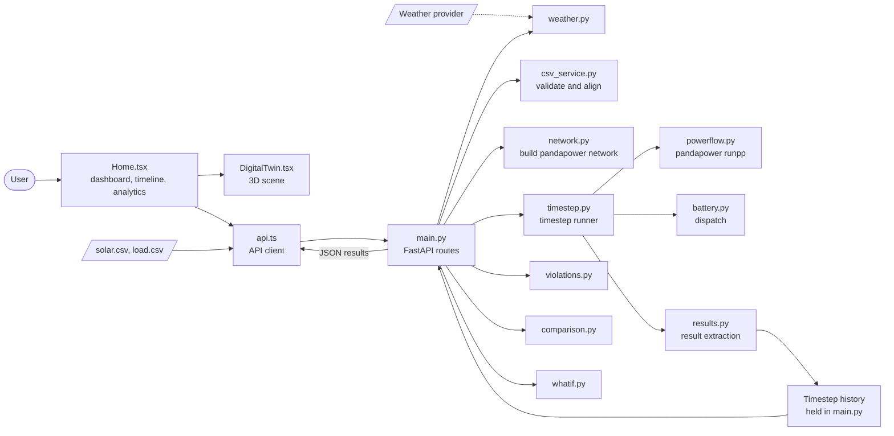
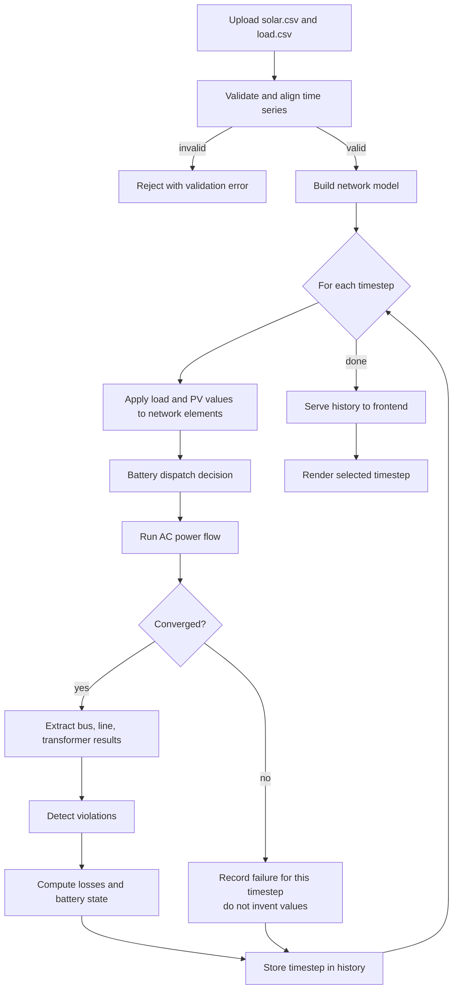
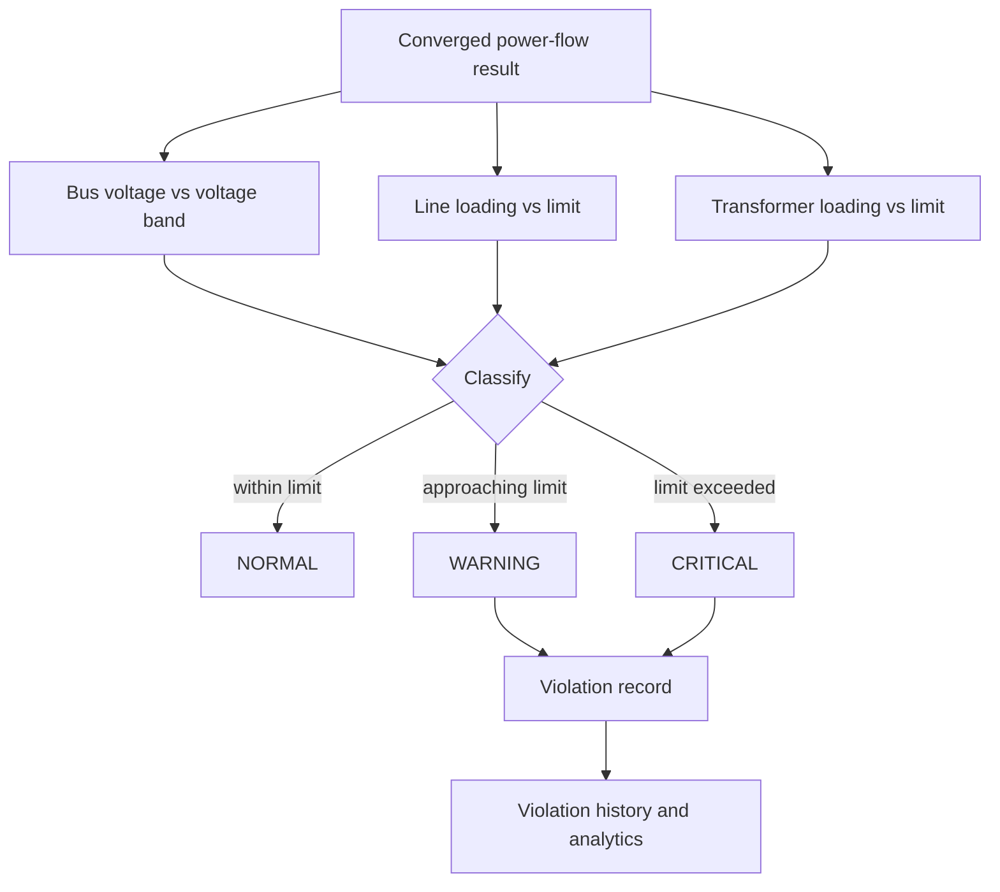
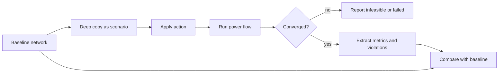
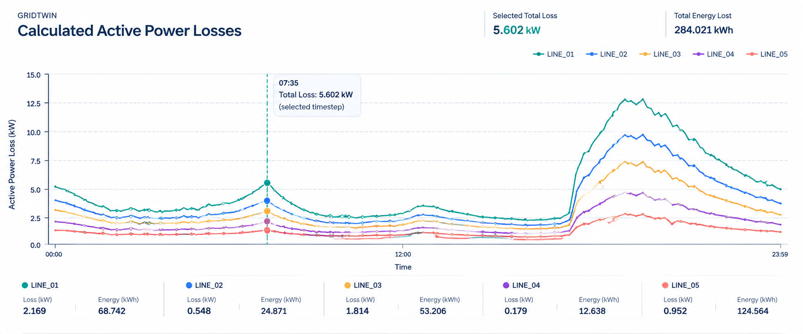
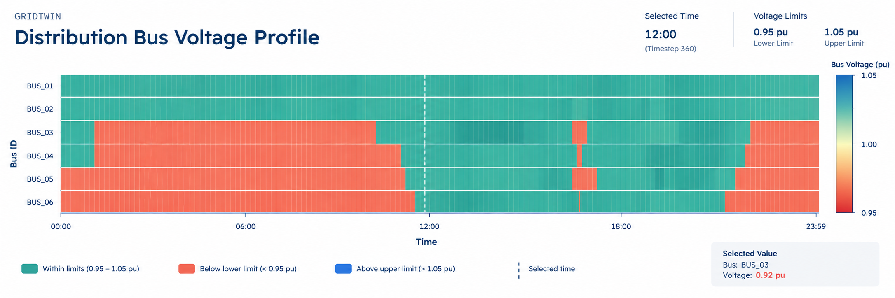
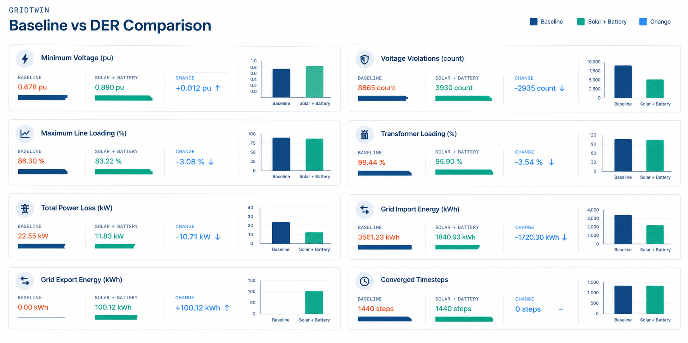
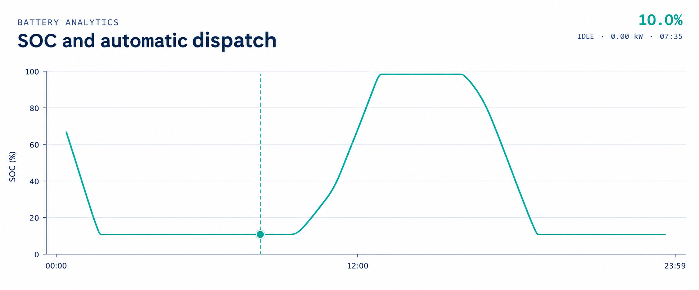
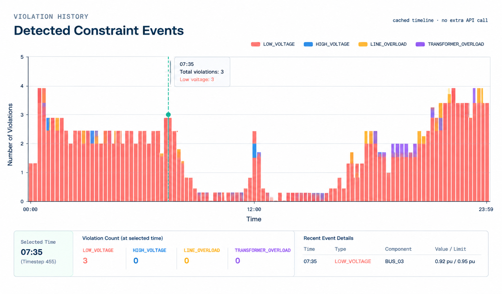
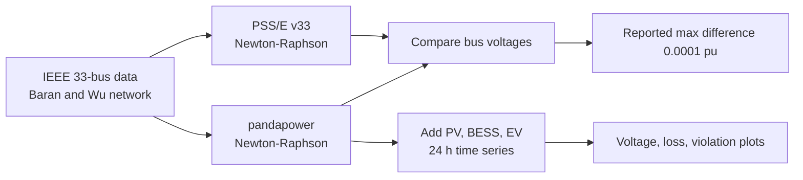

<h1 align="center">

GridTwin</h1>

<p align="center">
  <strong>Model. Simulate. Understand. The Grid.</strong><br>
  A physics-based 3D digital twin for renewable-rich electrical distribution networks.
</p>

<p align="center">
  
  
  
  
  
  
  
  
  
</p>

GridTwin runs time-series AC power-flow simulations of a small distribution feeder with solar PV, loads and a battery, then presents the calculated results in an interactive 3D scene with a synchronized timeline and analytics. The backend (Python, FastAPI, pandapower) is the single source of electrical truth; the frontend (React, TypeScript, Three.js) only visualizes what the backend returns.

GridTwin is an **offline simulation and decision-support prototype**. It is not connected to a live utility system, and it is not a substitute for a validated utility planning tool.

> **How to read status tags in this document**
>
> | Tag | Meaning |
> |---|---|
> | **Documented** | Described as part of the project's current scope in the previous README and its architecture map. |
> | **Unverified** | Named in the project brief but with no evidence in the previous README. Confirm against source before publishing. |
> | **Planned** | Roadmap item. Not implemented. |
> | **Reference** | Belongs to an external repository, not to GridTwin. |
>
> Items marked `VERIFY` are the only places where source-derived values still need to be filled in. They are collected in the [Verification checklist](#verification-checklist).

## Table of contents

1. [Overview](#1-overview)
2. [Capabilities and status](#2-capabilities-and-status)
3. [Architecture](#3-architecture)
4. [Simulation lifecycle](#4-simulation-lifecycle)
5. [Network model](#5-network-model)
6. [Glossary and physical principles](#6-glossary-and-physical-principles)
7. [Engineering methodology](#7-engineering-methodology)
8. [Violation detection and convergence handling](#8-violation-detection-and-convergence-handling)
9. [Battery and DER modelling](#9-battery-and-der-modelling)
10. [Baseline vs DER and What-If analysis](#10-baseline-vs-der-and-what-if-analysis)
11. [Timeline synchronization](#11-timeline-synchronization)
12. [Analytics and Simulation Results](#12-analytics-and-simulation-results)
13. [3D digital twin](#13-3d-digital-twin)
14. [Input data](#14-input-data)
15. [IEEE 33-bus reference](#15-ieee-33-bus-reference)
16. [Technology stack and repository structure](#16-technology-stack-and-repository-structure)
17. [Installation and running](#17-installation-and-running)
18. [API reference](#18-api-reference)
19. [Example workflow](#19-example-workflow)
20. [Screenshots](#20-screenshots)
21. [Testing and validation](#21-testing-and-validation)
22. [Limitations](#22-limitations)
23. [Troubleshooting](#23-troubleshooting)
24. [Roadmap](#24-roadmap)
25. [References, context and license](#25-references-context-and-license)
26. [Verification checklist](#verification-checklist)

---

## 1. Overview

**Problem.** Distribution networks were designed for one-way power flow from a substation to consumers. Rooftop and community solar reverses flow at midday, can raise voltage above limits, and adds thermal stress to lines and transformers. Batteries can help, but their effect depends on timing, size and location. Tabular power-flow output makes these time-varying interactions hard to see.

**Approach.** GridTwin couples a real AC power-flow solver with a spatial interface:

1. Solar, load and (optionally) weather data drive a network model at each timestep.
2. pandapower solves the power flow.
3. The backend derives voltages, loadings, losses, battery state and violations, and stores them per timestep.
4. The frontend renders one selected timestep across the 3D scene, inspector, KPIs and charts.

**Design contract.**

- Electrical values shown in the UI originate from backend calculation. The frontend does not synthesize voltages, loadings or losses.
- Violation state comes from calculated values compared with configured limits, not from frontend colour rules.
- A power flow that fails to converge must be reported as a failure, never as a successful result and never replaced with placeholder values. `VERIFY` that `powerflow.py` and `timestep.py` enforce this (see [section 8](#8-violation-detection-and-convergence-handling)).
- Simulated, measured, estimated, forecast and externally reported values are labelled distinctly (see [section 6.4](#64-value-provenance)).

**Key differentiators.** Real AC power flow rather than a heuristic; one canonical timeline position shared by every view; baseline-versus-scenario comparison on calculated values; an explicit boundary between what is implemented and what is roadmap.

---

## 2. Capabilities and status

| Capability | Status | What it does |
|---|---|---|
| 3D digital twin (React, Three.js, GLB/GLTF assets) | Documented | Select, orbit, pan, zoom and inspect network components. |
| AC power flow with pandapower | Documented | Newton–Raphson solution of bus voltages and branch flows per timestep. |
| Time-series simulation (minute resolution) | Documented | Steps through aligned solar and load data; stores each timestep. |
| Solar, load and battery modelling | Documented | Time-series PV and load inputs; battery with `CHARGE`, `IDLE`, `DISCHARGE` states. |
| Violation detection | Documented | Low voltage, line loading and transformer overload against configured limits; `NORMAL` / `WARNING` / `CRITICAL`. |
| Power-loss analytics | Documented | Loss analysis served by the backend. |
| Historical analysis and timeline | Documented | Play, pause, step, scrub, speed; all views follow `selectedTimestepIndex`. |
| Baseline vs DER comparison | Documented | Compares original and DER scenarios on calculated metrics (`comparison.py`). |
| What-If analysis | Documented | Applies an action to a copy of the network and compares with baseline (`whatif.py`). |
| Live weather context | Documented | Fetches weather through a provider API using `WEATHER_API_KEY`. |
| CSV upload and validation | Documented | Validates and aligns `solar.csv` and `load.csv` (`csv_service.py`). |
| Network Builder | Unverified | Named in the project brief; no evidence in prior documentation. |
| State Estimation | Unverified | Same. See [6.4](#64-value-provenance) for why it must not be confused with simulation. |
| Short-Circuit Analysis | Unverified | Same. |
| SCADA/EMS-style monitoring view | Unverified | If present, it is a simulated interface, not a utility integration. |
| Dataset Creator | Unverified | Same. |
| IEEE 33-bus benchmarking inside GridTwin | Unverified | The IEEE 33-bus work in this document is a **Reference** repository ([section 15](#15-ieee-33-bus-reference)). |
| Battery, curtailment, voltage and loss optimization | Planned | No optimization method is claimed. |
| SCADA, IoT, smart-meter and real-time ingestion | Planned | No live integration exists. |
| Machine learning and predictive constraint detection | Planned | |

---

## 3. Architecture

The module map below is taken from the project's file structure. `VERIFY` each module boundary against imports before release.



**Runtime boundary.** The browser talks only to the FastAPI service. All electrical computation runs server-side in Python. The 3D scene, charts and inspector are pure renderers of returned data.

**History and caching.** Calculated timesteps are stored so that moving the timeline reads a stored result and does not re-run pandapower. `VERIFY` where history is held (the architecture map places it in `main.py`) and that it is in-memory, meaning it is lost when the server restarts.

---

## 4. Simulation lifecycle



**Timestep execution.** For each timestep the runner sets the active load and PV output from the aligned inputs, asks the battery logic for a charge/idle/discharge decision, solves the power flow, extracts results, checks limits and appends a record to history. Resolution is minute-level per the project scope; the exact timestep length is taken from the aligned CSV timestamps (see [section 14](#14-input-data)).

`VERIFY`: the "record failure" branch above is the intended behaviour under the design contract. Confirm it matches `timestep.py` and note the actual behaviour (skip, carry forward, or abort) here.

---

## 5. Network model

The project describes its prototype as a **small radial distribution feeder** with an external grid, one transformer, distribution lines, loads, solar generation and one battery. The analytics specification names the buses `BUS_01`–`BUS_06` and the lines `LINE_01`–`LINE_05`, which supports a six-bus radial topology. The previous documentation states that the exact count and naming depend on the configured model, so use the exact casing from the source.

Fill the tables below directly from `backend/app/simulation/network.py`. Nothing in them should be assumed.

**Topology** (`VERIFY`: replace with the real connection order and IDs)

| Element | ID | From | To | Notes |
|---|---|---|---|---|
| External grid | `VERIFY` | | bus `VERIFY` | Slack reference, voltage setpoint (pu) |
| Transformer | `VERIFY` | HV bus | LV bus | Rated MVA, HV/LV kV, short-circuit voltage |
| Line | `LINE_01` (example) | bus `VERIFY` | bus `VERIFY` | Length km, R/X ohm/km, max current kA |
| Line | `LINE_02` … `LINE_05` (examples) | | | |
| Load | `VERIFY` | | bus `VERIFY` | P kW, Q kVAr |
| Solar PV | `VERIFY` | | bus `VERIFY` | Peak kW, reactive assumption |
| Battery | `VERIFY` | | bus `VERIFY` | Power kW, energy kWh, SOC limits, efficiency |

**Limits** (`VERIFY`: from `violations.py`)

| Quantity | Warning | Critical | Source |
|---|---|---|---|
| Bus voltage (pu) | `VERIFY` | `VERIFY` | `violations.py` |
| Line loading (%) | `VERIFY` | `VERIFY` | `violations.py` |
| Transformer loading (%) | `VERIFY` | `VERIFY` | `violations.py` |

A topology diagram is deliberately omitted until these are verified, so the README does not present an invented network. The prototype feeder is a demonstration model. It is **not** a model of any real utility network and is **not** the IEEE 33-bus system.

---

## 6. Glossary and physical principles

### 6.1 Network elements

| Term | Definition | In GridTwin |
|---|---|---|
| **Bus / node** | A connection point in the electrical model where voltage is evaluated. A modelling concept, not necessarily a physical object. | Voltage is reported per bus. |
| **Branch** | Any element linking two buses: a line or a transformer. | Lines and one transformer. |
| **Line / feeder** | Conductor carrying power between buses. | IDs such as `LINE_01`. Reports flow, loading, losses. |
| **Transformer** | Converts between voltage levels. | Loading and flow tracked. |
| **External grid** | Slack source that fixes voltage and absorbs the power imbalance. | Substation source in the pandapower model. |
| **Radial feeder** | Network with a single path from source to each load. | Prototype topology (`VERIFY`). |
| **Topology** | Which elements connect to which buses. | Defined in `network.py`. |

### 6.2 Electrical quantities

| Term | Units | Meaning |
|---|---|---|
| **Nominal voltage** | kV | Design voltage of a bus. |
| **Voltage magnitude (pu)** | dimensionless | `V_pu = V_actual / V_nominal`. 1.00 pu is nominal. Lets buses at different kV levels be compared. |
| **Voltage angle** | degrees | Phase angle of bus voltage relative to the slack bus. Angle differences drive active power flow. |
| **Active power P** | kW, MW | Power that does useful work. Loads consume it, PV and batteries supply it. |
| **Reactive power Q** | kVAr, MVAr | Power exchanged with electric and magnetic fields. Affects voltage and current without doing net work. |
| **Apparent power S** | kVA, MVA | `S = sqrt(P² + Q²)`. Sets equipment current and thermal duty. |
| **Power factor** | dimensionless | `PF = P / S`. |
| **Current / loading** | kA, % | Line loading `= I / I_max × 100`. Transformer loading is apparent power relative to rating. |
| **Thermal limit** | kA, MVA | Maximum continuous loading before overheating. |
| **Power-flow direction** | sign | Positive flow follows the branch's from→to convention. High PV can reverse flow toward the substation. |
| **Grid import / export** | kW | Net exchange at the external grid. Positive import means the feeder draws from the grid. |
| **Power loss** | kW | Instantaneous `P_loss = Σ I²R` over branches. |
| **Energy loss** | kWh | `E_loss = Σ P_loss × Δt`. Cumulative over time. |

### 6.3 Solver, DER and analysis terms

| Term | Meaning | In GridTwin |
|---|---|---|
| **AC power flow** | Solves nonlinear power-balance equations for bus voltages given injections. | Run by pandapower each timestep. |
| **Newton–Raphson** | Iterative method that linearizes the power-balance equations and updates voltage estimates until mismatches are small. | pandapower's default AC solver family. `VERIFY` any algorithm or tolerance override in `powerflow.py`. |
| **Convergence** | Solver reaches the mismatch tolerance within its iteration limit. Failure means no valid solution was found. | Must be surfaced as failure. |
| **Voltage violation** | Voltage outside the allowed band (low or high). | Detected by `violations.py`. |
| **Overload** | Loading above a thermal limit. | Line and transformer. |
| **DER** | Distributed energy resource: generation or storage connected in the distribution network. | PV and battery. |
| **PV** | Photovoltaic generation. | Driven by `solar.csv`. |
| **Curtailment** | Deliberate reduction of available generation. | **Planned** as an optimization. |
| **BESS** | Battery energy storage system. | One battery with `CHARGE`, `IDLE`, `DISCHARGE`. |
| **SOC** | State of charge: stored energy as a fraction of capacity. | Tracked per timestep. |
| **Time-series simulation** | Repeated steady-state solutions over successive timesteps. Not a dynamic (transient) simulation. | Core mode. |
| **Baseline / scenario** | Reference case versus a modified case. | Used by comparison and What-If. |
| **Short-circuit / fault current** | Current during a fault, used to size protection. | **Unverified** feature. |
| **State estimation** | Statistical estimate of the network state from redundant, noisy measurements. | **Unverified** feature. |
| **Measurement residual** | Difference between a measurement and the value implied by the estimated state. Large residuals indicate bad data. | Applies only if state estimation exists. |
| **Observability** | Whether the available measurements are sufficient to determine the full network state. | Applies only if state estimation exists. |
| **SCADA** | Supervisory Control and Data Acquisition: field telemetry and control. | No live SCADA integration (**Planned**). |
| **EMS** | Energy Management System: operator applications built on SCADA data. | No EMS integration. |

### 6.4 Value provenance

| Kind | Origin | Example | GridTwin |
|---|---|---|---|
| **Calculated / simulated** | Solver output from a model and assumed inputs | Bus voltage from pandapower | Yes. This is what the UI shows. |
| **Measured** | Physical sensor reading | Smart-meter kW | Not used. |
| **Estimated** | Statistical inference from measurements | State-estimator voltage | Not used unless State Estimation is verified. |
| **Forecast** | Prediction of a future input | Day-ahead PV | Not used. |
| **Externally reported** | Numbers from another project or paper | IEEE 33-bus results in [section 15](#15-ieee-33-bus-reference) | Attributed, never presented as GridTwin output. |

Common confusions:

- **kW vs kWh.** kW is a rate of energy transfer at an instant. kWh is energy accumulated over time. A 100 kW battery discharging for 30 minutes delivers 50 kWh.
- **Battery power vs battery energy.** Power rating limits how fast the battery charges or discharges. Energy capacity limits how long it can sustain that rate.
- **kV vs pu.** kV is absolute. pu is relative to the bus's nominal voltage, so 0.95 pu means something different in kV at 0.4 kV and at 11 kV.
- **Instantaneous loss vs cumulative loss.** kW at one timestep versus the sum of kW × Δt over a period.
- **Simulation vs state estimation.** Simulation predicts the state from assumed inputs. State estimation infers the state from measurements.

---

## 7. Engineering methodology

**Steady-state assumption.** Each timestep is an independent steady-state AC power-flow solution. Dynamics, protection behaviour and controller transients are not modelled. Balanced three-phase operation is assumed (pandapower's standard symmetric model).

**Solved system.** For each bus `i`:

```text
P_i = Σ_k |V_i||V_k| ( G_ik cos θ_ik + B_ik sin θ_ik )
Q_i = Σ_k |V_i||V_k| ( G_ik sin θ_ik − B_ik cos θ_ik )
```

where `G + jB` is the bus admittance matrix and `θ_ik = θ_i − θ_k`. Newton–Raphson iterates on `|V|` and `θ` until the power mismatches fall below tolerance.

**Net injection at a bus.**

```text
P_net = P_PV + P_battery_discharge − P_load − P_battery_charge
```

**Derived quantities.**

```text
V_pu             = V / V_nominal
line loading %   = I / I_max × 100
P_loss (kW)      = Σ over branches of branch active-power loss
E_loss (kWh)     = Σ_t P_loss(t) × Δt(hours)
```

pandapower reports line loading from current relative to `max_i_ka`, and transformer loading relative to rated apparent power. `VERIFY` that GridTwin uses these result columns directly and does not recompute them differently.

**Baseline vs DER methodology.** Run the same time series on the same network twice: once without the DER elements, once with them. Compare voltage extremes, number of violations, peak line and transformer loading, and total energy loss. Because the load and network are identical, differences are attributable to the DER. `VERIFY` the exact metric set in `comparison.py`.

**Assumptions to keep in mind.** Loads are represented as specified in the input data (constant-power vs other models: `VERIFY`). PV reactive-power behaviour is an assumption of the model (`VERIFY`). Weather is context and does not by itself change electrical results unless the source explicitly links it to PV output (`VERIFY`).

---

## 8. Violation detection and convergence handling



A violation record contains: timestamp, component type, component ID, violation type, actual value, configured limit and severity. The same classification drives the 3D colours (green, yellow, red), so the visual state and the analytics always agree.

**Thresholds.** The voltage heatmap uses a 0.95–1.05 pu band. Line and transformer limits and the warning/critical split are in [section 5](#5-network-model) (`VERIFY`). For context only: a ±5 % band (0.95–1.05 pu) is a common distribution-voltage convention, for example ANSI C84.1 Range A for service voltage. That is a widely used reference, not a statement about GridTwin's configuration.

**Convergence handling.** Required behaviour for a failed solve:

1. Do not present the timestep as successful.
2. Do not fill it with previous, interpolated or default values without labelling.
3. Make the failure visible in the API response and the UI.

Whether the current code does all three is a `VERIFY` item. If it does not, this section should say exactly what it does instead.

---

## 9. Battery and DER modelling

**Solar PV.** Generation is read from `solar.csv` per timestep and applied to the PV element(s).

**Battery states.**

| State | Meaning |
|---|---|
| `CHARGE` | Absorbing energy from the network. |
| `IDLE` | Neither charging nor discharging. |
| `DISCHARGE` | Supplying stored energy. |

**Generic SOC update** (the standard formulation; `VERIFY` against `battery.py`):

```text
Charging:     SOC(t+Δt) = SOC(t) + η_c · P_ch · Δt / E_cap
Discharging:  SOC(t+Δt) = SOC(t) − P_dis · Δt / (η_d · E_cap)

with  SOC_min ≤ SOC ≤ SOC_max   and   0 ≤ P ≤ P_rated
```

Parameters to document from source: `E_cap` (kWh), `P_rated` (kW), `SOC_min`, `SOC_max`, initial SOC, efficiencies and the dispatch rule (`VERIFY`, `battery.py`).

**Not implemented.** No optimal dispatch is claimed. Battery behaviour follows the dispatch logic in `battery.py`, whatever that is; do not describe it as optimized unless an optimization method is present.

---

## 10. Baseline vs DER and What-If analysis

**Baseline vs DER** compares two full simulations of the same inputs, one without and one with DER (see [section 7](#7-engineering-methodology)). Only calculated values are compared.

**What-If** evaluates a candidate action without altering the baseline.



The result reports consequences of the action: changes in voltage, loading, losses and violations. It does not rank actions, assign a score or declare an action optimal. `VERIFY` the supported action types in `whatif.py` and list them here.

---

## 11. Timeline synchronization

GridTwin holds one canonical simulation position, `selectedTimestepIndex`. Every view that shows a single timestep derives from it, so selecting `00:08` shows the `00:08` state everywhere and never mixes it with the latest result.

| View | Question it answers | Follows `selectedTimestepIndex` |
|---|---|---|
| 3D twin and inspector | What is each component doing now? | Yes |
| KPIs | Headline values at this timestep | Yes |
| Voltage profile | How does voltage vary across buses? | Yes |
| Line loading | Which lines are heavily used? | Yes |
| Power loss | Where and when do losses occur? | Yes for a single timestep; cumulative views span the run |
| Battery analytics | SOC, power, state | Yes; history charts span the run |
| Violation history | When and where were limits crossed? | Spans the run |
| Baseline vs DER | How does the DER case differ? | Depends on metric |

**Timeline controls:** play, pause, previous, next, slider, speed.

**What voltage profiles reveal.** Load pulls voltage down along the feeder. Distributed generation raises voltage near where it connects and can push it above the upper limit during high PV and low load. Losses follow current squared, so both heavy load and high reverse flow raise them.

---

## 12. Analytics and Simulation Results

This section presents the five analytics views of GridTwin. The interactive versions live in the running application (`client/src/pages/Home.tsx`, "History Analytics"); the PNG files below are **static previews**.

> **Current status of the figures.** All five files in `docs/images/` are individually generated, white-background figures. Because no simulation history was available when they were produced, each one is a clearly labelled **"Data unavailable"** figure that lists the exact fields it needs. They contain no estimated or invented values. Once you run a simulation and regenerate them from the stored history (see [Regenerating the figures](#regenerating-the-figures)), the same filenames will hold real results.

> **Provenance.** Every chart visualizes results calculated by the configured simulation model from the input CSVs. They are **not** live utility measurements. GridTwin has no verified live SCADA, IoT or smart-meter integration.

> **Static previews vs interactive charts.** GitHub renders README images as static pictures; they cannot be hovered, clicked or synchronized with the timeline. Interactivity exists only in the running application ([how to open it](#opening-the-interactive-dashboard)). No public deployment is documented, so no hosted link is given.

### What the quantities mean

| Quantity | Unit | Physical meaning |
|---|---|---|
| Voltage | pu | Bus voltage relative to its nominal value. 1.00 pu is nominal. Values outside 0.95–1.05 pu are flagged as voltage violations. |
| Active power loss | kW | Instantaneous power dissipated as heat in the lines (`I²R`) at one timestep. |
| Energy loss | kWh | Power loss accumulated over time, `Σ P_loss × Δt`. With 1-minute steps, `Δt = 1/60` h. |
| SOC | % | Energy stored in the battery as a percentage of its capacity. |
| Line loading | % | Line current relative to its rated maximum. Above 100 % means the thermal limit is exceeded. |
| Constraint violation | count, type | A calculated value outside its configured limit at a timestep, recorded with component, actual value and limit. |

Instantaneous kW and cumulative kWh must not be compared directly. See [section 6.2](#62-electrical-quantities).

### Power Loss Analytics

Shows active power loss in each of the five feeder lines (`LINE_01`–`LINE_05`), the total active loss (kW) at the selected timestep and the cumulative energy loss (kWh).



*Interpretation.* Losses scale with current squared, so peaks coincide with heavy load or strong reverse flow at high PV. A line with a persistently larger curve carries more current. Read kW at a timestep and kWh over a period as separate quantities. *Data needed:* per-line loss (kW) per timestep from the stored history. *Simulation-derived, not measured.* Interactive view: run the application locally ([instructions](#opening-the-interactive-dashboard)).

### Voltage Profile Heatmap

Shows `BUS_01`–`BUS_06` (or the bus IDs verified in `network.py`) across simulation time, with 0.95 pu, 1.00 pu and 1.05 pu reference levels and violations highlighted.



*Interpretation.* Voltage normally falls with distance from the substation under load and rises near PV at midday. Cells below 0.95 pu indicate low voltage; above 1.05 pu indicate high voltage, typically from PV export at low load. A non-converged timestep must be shown as missing, not as a colour. *Data needed:* per-bus voltage (pu) per timestep from the power-flow results. *Simulation-derived, not measured.* Interactive view: [instructions](#opening-the-interactive-dashboard).

### Baseline vs DER Comparison

Compares the baseline case with the Solar + Battery case: minimum voltage, voltage violations, maximum line loading, transformer loading, power losses, grid import and export energy, and converged timesteps.



*Interpretation.* Both cases use the same network and time series, so differences are attributable to the DER. Lower import with higher export shows the DER offsetting demand; a rise in maximum voltage or a new violation shows a side effect. Only metrics supplied by `comparison.py` should appear. *Data needed:* baseline and DER results with the change for each metric. *Simulation-derived, not measured.* Interactive view: [instructions](#opening-the-interactive-dashboard).

### Battery Analytics

Shows battery SOC (%) over time with the selected timestep, plus charge/discharge power and dispatch mode where those fields exist.



*Interpretation.* SOC rises while the battery is in `CHARGE` and falls in `DISCHARGE`; flat sections correspond to `IDLE` or to a limit being reached. SOC limits, where configured, bound the curve. Power (kW) sets how fast SOC changes; energy capacity (kWh) sets how long it can be sustained. *Data needed:* SOC, power and mode per timestep from the battery history. *Simulation-derived, not measured.* Interactive view: [instructions](#opening-the-interactive-dashboard).

### Violation History

Shows constraint-event counts over time, with type (`HIGH_VOLTAGE`, `LOW_VOLTAGE`, `LINE_OVERLOAD`, `TRANSFORMER_OVERLOAD` where implemented), affected component, actual value and limit.



*Interpretation.* A count of zero means the solver converged and no limit was exceeded, which is different from a timestep that failed to converge or has no data; the two must be shown differently. Clusters of events around midday point to PV-driven high voltage, evening clusters to load-driven low voltage or overload. *Data needed:* violation records (timestamp, type, component ID, actual value, limit). *Simulation-derived, not measured.* Interactive view: [instructions](#opening-the-interactive-dashboard).

### Opening the interactive dashboard

The interactive charts are part of the frontend and need a running backend with a completed simulation:

```powershell
# Terminal 1: backend (from the repository root, venv active)
py -m uvicorn app.main:app --app-dir backend --reload

# Terminal 2: frontend
pnpm install
pnpm dev
```

Open the frontend address (typically `http://localhost:3000`), upload `solar.csv` and `load.csv`, run the simulation, then open the analytics panels.

Documented: the timeline and `selectedTimestepIndex` drive the 3D twin, KPIs and single-timestep analytics, and history is cached so scrubbing reads stored results without re-running the power flow.

`VERIFY` in the source before advertising any of the following, since none is confirmed by the available documentation:

- Hover tooltips with timestamp, timestep index, component ID, value and unit.
- Clicking a chart point or heatmap cell to select its timestep (and bus).
- A synchronized selected-timestep marker on every time-series chart.
- Explicit states for non-converged timesteps, unavailable data and missing measurements, with no interpolated or invented values drawn.

### Regenerating the figures

Run a simulation, export the stored history, and regenerate each figure from it with Matplotlib (white background, labelled axes with units, legend), overwriting the five files in `docs/images/`. The sample input profiles (input data, not results) are in [`docs/images/input_profiles.png`](docs/images/input_profiles.png).

---

## 13. 3D digital twin

Built with React, Three.js and React Three Fiber, using GLB/GLTF models. The scene represents houses (loads), solar panels and farms, battery, transformer, substation, buses and distribution lines.

- **Interaction:** rotate, pan, zoom, select, inspect, focus on a component.
- **Animated power flow:** flow lines follow calculated branch flow.
- **Colour state:** green `NORMAL`, yellow `WARNING`, red `CRITICAL`, derived from calculated loading or voltage against configured limits (see [section 8](#8-violation-detection-and-convergence-handling)).

The scene is a schematic spatial layout. Distances in the scene are not to scale with line lengths in the model.

---

## 14. Input data

GridTwin uses two time-series files:

| File | Represents |
|---|---|
| `solar.csv` | Generation |
| `load.csv` | Consumption |

Both are validated and aligned by `backend/app/services/csv_service.py` before simulation.

**Schema** (from the sample `load.csv` and `solar.csv`)

| File | Columns | Type | Unit | Rows |
|---|---|---|---|---|
| `load.csv` | `Time`, `load_kw` | text `HH:MM`, decimal | kW | 1440 |
| `solar.csv` | `Time`, `solar_kw` | text `HH:MM`, decimal | kW | 1440 |

```csv
Time,load_kw          Time,solar_kw
00:00,94.73           00:00,0.0
00:01,94.65           00:01,0.0
00:02,94.61           00:02,0.0
```

**Properties of the sample files** (measured directly from them):

| Property | `load.csv` | `solar.csv` |
|---|---|---|
| Timestep | 1 minute, all 1439 intervals | 1 minute, all 1439 intervals |
| Coverage | `00:00`–`23:59` (one day) | `00:00`–`23:59` (one day) |
| Missing or duplicate times | none | none |
| Negative values | none | none |
| Minimum | 73.49 kW at 03:47 | 0.0 kW (night) |
| Maximum | 180.0 kW at 19:11 | 190.0 kW at 12:28 |
| Daily energy (`Σ P/60`) | 2983.4 kWh | 1512.3 kWh |

The `Time` columns are identical in both files. Solar is non-zero from 05:31 to 19:29, and solar power exceeds load power in 340 of the 1440 minutes. That is a comparison of the two input series only. It says nothing about voltages or flows, which come from the power flow. The input plot is available as [`docs/images/input_profiles.png`](docs/images/input_profiles.png) (input data, not a simulation result).

**Validation rules.** The properties above describe the sample files. Which of them `csv_service.py` actually enforces (required headers, time format, ordering, non-negativity, equal length) is `VERIFY`. Do not document a rule as enforced until it is confirmed in the code.

Inspect your own files the same way:

```powershell
Get-Content solar.csv -TotalCount 5
Get-Content load.csv -TotalCount 5
```

**Timestep handling.** Timesteps come from the aligned timestamps and are minute-level per the project scope. The sample files use 1440 rows, so timestep indices run from 0 to 1439 for `00:00`–`23:59`. Because `Time` has no date, the sample files describe one day. How mismatched ranges are handled (reject, trim, resample) is defined in `csv_service.py` (`VERIFY`).

**Weather.** Optional context from a weather provider through `weather.py`:

```json
{
  "status": "LIVE WEATHER",
  "temperature_c": 29,
  "cloud_cover_percent": 7,
  "solar_irradiance_w_m2": 930,
  "humidity_percent": 74,
  "wind_speed_m_s": 4.63
}
```

This is an example response shape, not measured data from a specific site. Behaviour on provider failure or missing key (demo mode or error) is `VERIFY`.

Provenance: `solar.csv` and `load.csv` values are whatever the user supplies. Record the source and licence of any dataset you commit to the repository.

---

## 15. IEEE 33-bus reference

GridTwin's own model is the small prototype feeder in [section 5](#5-network-model). The IEEE 33-bus system is a different network. A **separate, external repository** implements it with pandapower; it is cited here as a methodological reference, and its results are its own.

**Reference:** [Chinmaya-J-Jena/der_load_flow_IEEE33bus](https://github.com/Chinmaya-J-Jena/der_load_flow_IEEE33bus) (MIT). **Status: Reference.** GridTwin does not reproduce or validate these numbers.



**What the reference repository reports** (from its README; not independently reproduced here):

| Item | Value reported by the reference repository |
|---|---|
| Network | IEEE 33-bus radial, base voltage 12.66 kV, base load 3.715 MW + j2.300 MVAr |
| Base case min / max voltage | 0.9131 pu (bus 18) / 1.0000 pu (bus 1) |
| Buses below 0.95 pu, base case | 21 |
| Base case active loss | 0.2027 MW |
| pandapower vs PSS/E | All 33 buses within 0.0001 pu |
| DER assets | PV 2.0 MW at buses 14 and 31; BESS 0.5 MW / 2.0 MWh at bus 31; EV 1.5 MW at bus 28 |
| BESS rule | Charge when PV > 30 % of rating and SOC < 90 %, 06:00–15:00; discharge SOC > 20 %, 18:00–22:00; efficiency 95 % |
| With DER | Min voltage 0.9405 pu (bus 29); buses below 0.95 pu: 6 |

Limitations of that evidence: the PSS/E case is proprietary and the comparison covers the base case only; the DER results come from rule-based dispatch on a specific 24-hour profile.

**Reproduce the reference results** (commands from that repository; the PSS/E comparison needs its saved case file):

```powershell
git clone https://github.com/Chinmaya-J-Jena/der_load_flow_IEEE33bus.git
cd der_load_flow_IEEE33bus
py -m pip install -r requirements.txt
py src\main.py
py src\compare_psse_pandapower.py
```

**Prototype feeder vs IEEE 33-bus**

| | GridTwin prototype | IEEE 33-bus (reference repo) |
|---|---|---|
| Purpose | Interactive 3D twin demonstration | Load-flow and DER research benchmark |
| Size | Small radial feeder (`VERIFY` bus count) | 33 buses |
| Front end | React 3D UI | Matplotlib plots |
| Validated against | No external validation claimed | PSS/E (base case, per that repo) |

Any future GridTwin-native IEEE 33-bus benchmark should publish its own commands, data source and results before being described as validated. See [Roadmap](#24-roadmap).

---

## 16. Technology stack and repository structure

| Layer | Technology |
|---|---|
| Frontend | React, TypeScript, Vite, pnpm |
| 3D | Three.js, React Three Fiber, GLB/GLTF |
| Backend | Python, FastAPI, Uvicorn |
| Power system | pandapower |
| Data | pandas, NumPy |
| External | Weather provider API |

Exact versions: see `backend/requirements.txt` and `package.json` (`VERIFY`: record the Python and Node versions the project supports).

```text
backend/
  requirements.txt
  .env                     # local only, not committed
  app/
    main.py                # FastAPI routes, history and loss analytics
    services/
      csv_service.py       # CSV validation and alignment
      weather.py           # weather provider client
    simulation/
      network.py           # pandapower network construction
      powerflow.py         # power-flow execution
      timestep.py          # per-timestep runner
      battery.py           # battery dispatch
      results.py           # result extraction
      violations.py        # constraint detection
      comparison.py        # baseline vs DER
      whatif.py            # scenario analysis
client/
  src/
    lib/api.ts             # API client
    pages/Home.tsx         # dashboard, timeline, analytics
    components/digital-twin/DigitalTwin.tsx   # 3D scene
docs/
  images/                  # analytics figures and input profile plot
```

| Path | Responsibility |
|---|---|
| [`backend/app/main.py`](backend/app/main.py) | HTTP interface, orchestration, history |
| [`backend/app/services/csv_service.py`](backend/app/services/csv_service.py) | Input validation |
| [`backend/app/services/weather.py`](backend/app/services/weather.py) | Weather context |
| [`backend/app/simulation/network.py`](backend/app/simulation/network.py) | Network model |
| [`backend/app/simulation/powerflow.py`](backend/app/simulation/powerflow.py) | AC power flow |
| [`backend/app/simulation/timestep.py`](backend/app/simulation/timestep.py) | Time-series loop |
| [`backend/app/simulation/battery.py`](backend/app/simulation/battery.py) | Battery logic |
| [`backend/app/simulation/results.py`](backend/app/simulation/results.py) | Result assembly |
| [`backend/app/simulation/violations.py`](backend/app/simulation/violations.py) | Limits and severity |
| [`backend/app/simulation/comparison.py`](backend/app/simulation/comparison.py) | Baseline vs DER |
| [`backend/app/simulation/whatif.py`](backend/app/simulation/whatif.py) | What-If |
| [`client/src/lib/api.ts`](client/src/lib/api.ts) | Frontend API access |
| [`client/src/pages/Home.tsx`](client/src/pages/Home.tsx) | Main UI |
| [`client/src/components/digital-twin/DigitalTwin.tsx`](client/src/components/digital-twin/DigitalTwin.tsx) | 3D twin |

Additional modules for the **Unverified** features (Network Builder, State Estimation, Short-Circuit, SCADA-style view, Dataset Creator) are not listed because none appear in the documented structure. Add them here only when they exist.

---

## 17. Installation and running

**Prerequisites:** Python, Node.js, pnpm, Git. `VERIFY` minimum versions.

### Backend (Windows PowerShell)

```powershell
py -m venv .venv
.\.venv\Scripts\Activate.ps1
py -m pip install -r backend\requirements.txt
```

If script execution is blocked, allow it for the current session only:

```powershell
Set-ExecutionPolicy -Scope Process -ExecutionPolicy Bypass
```

### Environment variables

Create `backend/.env`:

```env
WEATHER_API_KEY=your_api_key_here
```

Never commit this file. Confirm `.env` is listed in `.gitignore`.

### Run the backend

```powershell
py -m uvicorn app.main:app --app-dir backend --reload
```

Default address `http://127.0.0.1:8000`, interactive docs at `http://127.0.0.1:8000/docs`.

### Run the frontend

```powershell
pnpm install
pnpm dev
```

Typical address `http://localhost:3000`. The port depends on the Vite configuration.

### macOS / Linux equivalents

```bash
python3 -m venv .venv
source .venv/bin/activate
python -m pip install -r backend/requirements.txt
python -m uvicorn app.main:app --app-dir backend --reload
pnpm install && pnpm dev
```

The project documentation covers Windows; the commands above are the standard equivalents and have not been separately confirmed.

---

## 18. API reference

FastAPI generates the authoritative contract from the route declarations. Rather than hand-copy routes that may drift, list them from the running server:

```powershell
# Start the backend first, then:
(Invoke-RestMethod http://127.0.0.1:8000/openapi.json).paths.PSObject.Properties |
  ForEach-Object { $_.Name + "  " + (($_.Value.PSObject.Properties.Name) -join ",") }
```

Browse request and response schemas at `http://127.0.0.1:8000/docs`.

`VERIFY`: replace this table with the real routes once listed.

| Method | Path | Purpose | Request | Response |
|---|---|---|---|---|
| `VERIFY` | `VERIFY` | Upload/validate CSVs | | |
| `VERIFY` | `VERIFY` | Run simulation | | |
| `VERIFY` | `VERIFY` | Get timestep / history | | |
| `VERIFY` | `VERIFY` | Weather | | |
| `VERIFY` | `VERIFY` | Violations, losses | | |
| `VERIFY` | `VERIFY` | Baseline vs DER | | |
| `VERIFY` | `VERIFY` | What-If | | |

---

## 19. Example workflow

1. Start the backend and frontend ([section 17](#17-installation-and-running)).
2. Open the frontend and upload `solar.csv` and `load.csv` (schema in [section 14](#14-input-data)).
3. Run the simulation. Wait for the history to be produced.
4. Open the 3D twin, click a component to inspect voltage, loading or SOC.
5. Scrub the timeline. Confirm the twin, KPIs and charts change together.
6. Open the analytics: voltage profile, loading, losses, battery, violations.
7. Run Baseline vs DER, then a What-If action, and compare metrics.

**Reproducibility.** For identical `solar.csv`, `load.csv`, network parameters and library versions, the power-flow results are deterministic. Weather is fetched live, so it will differ between runs. Record `pandapower` and Python versions with any results you publish:

```powershell
py -m pip freeze | Select-String "pandapower|numpy|pandas|fastapi"
```

---

## 20. Screenshots

No application screenshots were available when this README was written. Add real captures and reference them with relative paths; do not commit mock images.

| Suggested capture | Suggested path |
|---|---|
| 3D twin with a violation highlighted | `docs/screenshots/twin-violation.png` |
| Timeline with voltage profile | `docs/screenshots/timeline-voltage.png` |
| Baseline vs DER comparison | `docs/screenshots/baseline-vs-der.png` |

---

## 21. Testing and validation

No automated test suite or CI is documented, so no test or coverage badge is shown.

**What can be claimed today:** the solver is pandapower, a widely used open-source power-flow library. **What cannot:** GridTwin has no documented external validation, and no accuracy or performance figures are claimed.

Recommended checks to add and then document here:

| Check | How |
|---|---|
| Power balance | At a converged timestep, generation − load − losses ≈ 0 within tolerance. |
| Independent recompute | Rebuild one timestep directly in pandapower and compare voltages with the API result. |
| Violation logic | Unit-test limit classification at, just below and just above each threshold. |
| Failure path | Force a non-convergent case and confirm it is reported as a failure. |
| CSV validation | Feed malformed, misaligned and empty files and confirm clear rejection. |
| Battery bounds | Assert SOC and power never leave configured limits. |

---

## 22. Limitations

- Steady-state, balanced, positive-sequence analysis only; no dynamics, harmonics, unbalance or protection modelling.
- The prototype feeder is a simplified demonstration, not a real utility network.
- Not connected to live SCADA, IoT, smart meters or any control system, and it issues no control commands.
- No optimization, so results show consequences of chosen inputs and actions, not best solutions.
- Simulated results depend on the quality and representativeness of the input CSVs.
- Weather is contextual and live; it is not a forecast.
- History appears to be held by the server process, so it may not persist across restarts (`VERIFY`).
- The five analytics figures in this README are currently "Data unavailable" placeholders until regenerated from real simulation history.
- The IEEE 33-bus results in this document are from an external repository.

---

## 23. Troubleshooting

| Symptom | Likely cause | Action |
|---|---|---|
| `Activate.ps1` cannot be loaded | PowerShell execution policy | Use the session-only policy command in [section 17](#17-installation-and-running). |
| `ModuleNotFoundError` | Venv not active or dependencies missing | Activate `.venv`, rerun the `pip install`. |
| `Could not import module "app.main"` | Wrong working directory | Run from the repository root with `--app-dir backend`. |
| Frontend cannot reach the API | Backend not running or different port | Check `http://127.0.0.1:8000/docs`; check the API base URL in `client/src/lib/api.ts`. |
| CORS error in the browser | Origin not allowed by the backend | Check CORS settings in `main.py` (`VERIFY`). |
| Weather missing | `WEATHER_API_KEY` unset or provider error | Check `backend/.env` and provider status. |
| CSV rejected | Header, timestamp or alignment rule violated | Compare against the schema in [section 14](#14-input-data). |
| A timestep shows no result | Power flow did not converge | Inspect that timestep's inputs; reduce extreme injections. |
| Port already in use | Another process on 8000 or 3000 | Stop it or pass `--port` to Uvicorn and update the client. |

---

## 24. Roadmap

| Stage | Items |
|---|---|
| **Documented today** | 3D twin, pandapower, solar/load/battery, weather, time-series simulation, violations, losses, history, What-If, Baseline vs DER |
| **To confirm** | Network Builder, State Estimation, Short-Circuit Analysis, SCADA/EMS-style view, Dataset Creator, GridTwin-native IEEE 33-bus benchmark |
| **Planned** | Battery, curtailment, voltage and loss optimization; SCADA, IoT and smart-meter ingestion; machine-learning prediction of constraints |

Real-time integration needs additional engineering, security, data-quality and validation work, and any recommendation from a future predictive layer should remain decision support with a human in the loop.

---

## 25. References, context and license

**References**

- pandapower: [pandapower.org](https://www.pandapower.org/) and Thurner et al., "pandapower — an open-source Python tool for convenient modeling, analysis, and optimization of electric power systems," *IEEE Transactions on Power Systems*, 33(6), 2018.
- Baran, M.E. and Wu, F.F., "Network reconfiguration in distribution systems for loss reduction and load balancing," *IEEE Transactions on Power Delivery*, 4(2), 1989, pp. 1401–1407.
- External reference implementation: [der_load_flow_IEEE33bus](https://github.com/Chinmaya-J-Jena/der_load_flow_IEEE33bus).

**Sustainable Development Goals.** GridTwin's subject matter relates most directly to SDG 7 (Affordable and Clean Energy), with supporting relevance to SDGs 9, 11, 12 and 13. This describes topical alignment, not measured impact.

**License.** MIT. Confirm a `LICENSE` file exists at the repository root before publishing the badge.

---

## Verification checklist

Everything below could not be confirmed without the GridTwin source and should be filled from code, then this checklist deleted.

- [ ] Six-bus topology, component IDs, transformer, line, load, PV and battery parameters ([section 5](#5-network-model)).
- [ ] Voltage, line and transformer thresholds ([section 5](#5-network-model), [8](#8-violation-detection-and-convergence-handling)).
- [ ] Behaviour on non-convergence ([section 4](#4-simulation-lifecycle), [8](#8-violation-detection-and-convergence-handling)).
- [ ] Battery parameters and dispatch rule ([section 9](#9-battery-and-der-modelling)).
- [ ] What-If action types and Baseline vs DER metrics ([section 10](#10-baseline-vs-der-and-what-if-analysis)).
- [ ] Which CSV validation rules `csv_service.py` enforces; headers and units are already confirmed from the sample files ([section 14](#14-input-data)).
- [ ] Weather failure or demo-mode behaviour ([section 14](#14-input-data)).
- [ ] Real API routes and schemas ([section 18](#18-api-reference)).
- [ ] Python and Node versions, CORS, history persistence ([sections 16, 17, 22](#16-technology-stack-and-repository-structure)).
- [ ] Whether Network Builder, State Estimation, Short-Circuit, SCADA-style view, Dataset Creator and any IEEE 33-bus benchmark exist ([section 2](#2-capabilities-and-status)).
- [ ] Existing screenshots ([section 20](#20-screenshots)) and a `LICENSE` file.
- [ ] Regenerate the five analytics figures from real simulation history, and confirm the interaction behaviours listed in [section 12](#opening-the-interactive-dashboard).
